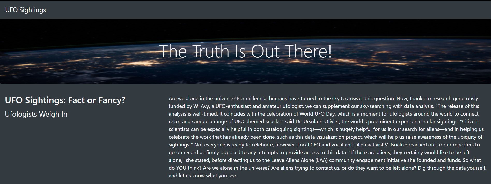

# UFO Data Analysis

## Overview of Project

#### Prompt: Dana’s webpage and dynamic table are working as intended, but she’d like to provide a more in-depth analysis of UFO sightings by allowing users to filter for multiple criteria at the same time. In addition to the date, you’ll add table filters for the city, state, country, and shape.

Our task for this week was to help out Dana with her own project in creating a simple website to both __*present and filter*__ through logged data of UFO sightings. With a small dataset provided, the challenge was in both creating a *html* and *javascript* file to present on a local server, before presumably publishing the website. 

The project was slightly above the bare mminimum for presentation as it mostly acts as a proof of concept.

## Results
* As we reach the home page set by our html file we will run across a simple layout with our set up titles and paragraphs on UFOs and their possible sightings. All of this is flavor text.

* As we head down towards the bottom left, we will see a table labled for filtering our data seen on the right. __*Without the use of any filters*__ the entire dataset is already laid out and available to scroll through. Using the filters and following with a hit of the *Enter* key will change the results available to match the filters set up by user.

* Here is an example of the filter in use as I typed in __*md*__ within the *State* filter to narrow down the search results to only include those sightings placed within __*Maryland*__. The dataset is limited to what is available, so there is not many options available to sift through, though it again is a proof of concept.
* Also, note that in this example, it will only recognize __lowercase__ letters due to the dataset and a lack of broadening of filtering to exclude case sensitivity.

## Summary
* Overall, as a proof of concept the web page does work properly and displays the filtration of data properly. However, there are a few things needed in order to make it more viable as a functional web page:
    * The data set is __extremely small__, though this is a proof of concept, it still cannot be ignored that a proper leading UFO sighting website should have a vast wealth of UFO sightings to filter through.
    * The code doesn't account for __case sensitivity__. On a user interface level, it is necessary to block that case sensitivity or else first time users will think that the web page isn't working properly.
    * Just making it __look better__ will significantly improve user reviews. In this day and age plenty of people, myself included, will think a website is sketchy simply based off of first impressions on whether the site looks professional or not. If this isn't improved, user numbers would never rise any higher as people could think it's a web site for phishing information. 
    * The __*State* and *Country* filters__ would be counterintuitive if there were more countries added, especially those that don't use states. UFO sightings are an international experience. 
    * Lastly, __more resources__ such as tabs that include more famous sightings, even photos or videos, news clippings, would make it much more immersive as a user experience in helping show the vast array of purported sightings are around the world.

  
